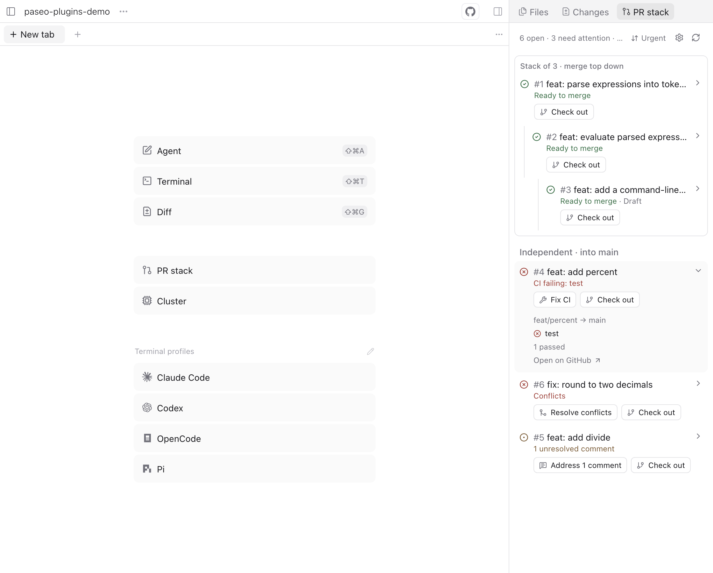
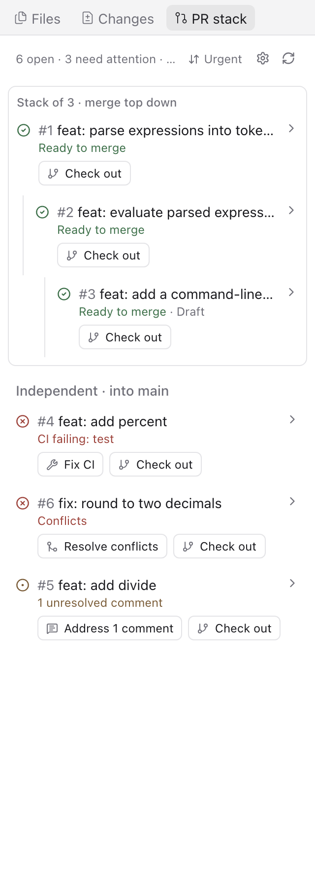
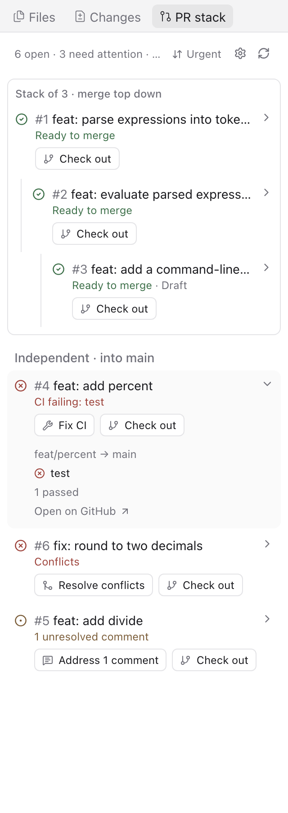
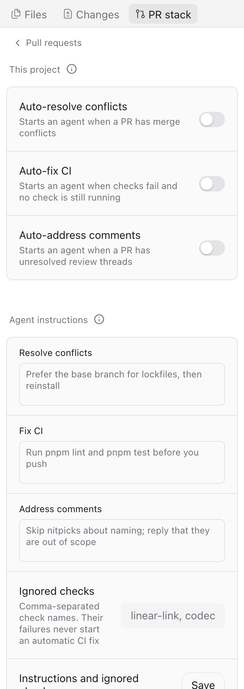
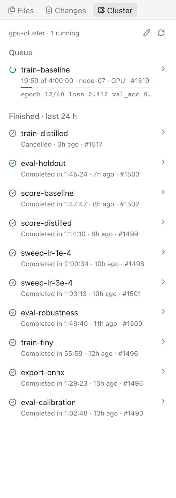

# Paseo plugins

Two plugins for [Paseo](https://paseo.sh). Each one adds a panel to the right sidebar of a workspace, in the desktop, web and mobile apps. They run in the Paseo daemon and app, so they work with every agent provider: Claude Code, Codex, OpenCode and the others.



| Plugin    | Panel    | Use it for                                                                                                                    |
| --------- | -------- | ----------------------------------------------------------------------------------------------------------------------------- |
| `factory` | PR stack | Your open pull requests: merge order, stacks, CI, reviews and conflicts, with one-click fixes and agents that fix PRs for you |
| `lab`     | Cluster  | Your Slurm jobs on a remote cluster: queue pipelines, progress, finished jobs and logs                                        |

## Install

Run this once on the machine that runs Paseo:

```bash
paseo plugin add github:rk68/paseo-plugins:factory && paseo plugin add github:rk68/paseo-plugins:lab
```

Then turn on **Settings → Plugins → Enable plugins**, if it is not on already. That switch covers every plugin on the host.

- If your shell has no `paseo` command, the macOS desktop app includes it at `/Applications/Paseo.app/Contents/Resources/bin/paseo`.
- To install only one plugin, run only its half of the command.
- To install from the app instead, paste `github:rk68/paseo-plugins:factory` or `github:rk68/paseo-plugins:lab` into **Settings → Plugins → Plugin source**.
- To get new versions, run `paseo plugin update --all`. Plugins and their settings stay in place when the Paseo app updates.
- Open a panel with Cmd+K: "Open PR stack" or "Open cluster jobs". You can also right-click the tab row of the right sidebar.

**Requirements**

- Paseo 0.9.1 or later.
- `factory`: `gh` logged in with access to your repositories, and `git`.
- `lab`: an SSH host in `~/.ssh/config` that runs Slurm and logs in without a password prompt.

**Security.** Plugins run without a sandbox. `factory` runs `gh` and `git` in your repositories and can start agents that push to your PR branches. `lab` runs `ssh` to the host you configure.

## factory: PR stack

<table>
  <tr>
    <td width="33%"></td>
    <td width="33%"></td>
    <td width="33%"></td>
  </tr>
  <tr>
    <td>Stacks in merge order, then the PRs that need you</td>
    <td>Tap a PR for its failing checks and links</td>
    <td>Automation for each project</td>
  </tr>
</table>

- **Stacks.** PRs built on another PR's branch are grouped in merge order on a rail. A stack is found from the PR base and from git ancestry, so a branch built on another branch is found even when its PR targets `main`. Press a stack's title to collapse it to one line with its PR numbers and status.
- **One status line for each PR**, most urgent first: conflicts, failing CI with check names, changes requested, unresolved comments, needs update, CI running, review required, ready to merge.
- **One-click actions on every row:**

  | Action                    | What it does                                                                                 |
  | ------------------------- | -------------------------------------------------------------------------------------------- |
  | Change base to main       | Runs `gh pr edit --base main` on a PR whose base has no open PR, such as a merged parent     |
  | Update branch             | Runs `gh pr update-branch`                                                                   |
  | Resolve conflicts         | Starts an agent that merges the base, resolves the conflicts, runs the checks and pushes     |
  | Fix CI                    | Starts an agent that reads the failing logs and fixes the cause, without weakening any check |
  | Address comments          | Starts an agent that fixes or answers each unresolved review thread, then resolves it        |
  | Mark ready                | Runs `gh pr ready` on a draft PR                                                             |
  | Squash and merge          | Runs `gh pr merge --squash` after a second press to confirm. It fails if the head changed    |
  | Archive agent             | Archives the PR's finished task agents and their worktree workspaces                         |
  | Check out / Open worktree | Opens the PR branch as a Paseo workspace, ready for your edits                               |

  To land a stack, merge the top PR, then press Change base to main on the next PR. If the new base gives conflicts or failing CI, the row offers Resolve conflicts or Fix CI. When the row reads "Ready to merge", Squash and merge shows. Change base to main does not show when the base is someone else's open PR.

  Squash and merge shows only on a row that reads "Ready to merge", targets trunk directly, and only when the repository allows squash merges and you have write access.

  Agents run Claude Opus 5.5 in a new worktree that starts at the PR head. They never rebase, force-push, change the base or merge.

- **Automation.** The gear icon has switches for each project: auto-resolve conflicts, auto-fix CI and auto-address comments. It also holds extra agent instructions for each task, and checks that never start an automatic fix. Automatic runs start one task per PR at a time, at most 2 per repository, one per head commit, and 3 per PR and task.
- **Scope and order.** In a worktree, the panel shows only the PRs related to its branch, with a link to show all. Sort by urgency or by newest.

## lab: Cluster

<table>
  <tr>
    <td width="33%"></td>
    <td>

- Connects to a Slurm host over SSH and refreshes every 30 seconds.
- **Queue.** Running and waiting jobs as dependency pipelines that you can collapse into their first job.
  - Running jobs show a spinner, elapsed time against the time limit, a progress bar and the last log line.
  - Waiting jobs show the reason in plain words, such as `After #1517` or `Over CPU quota`.
- **Finished in the last 24 h.** The result, run time, exit code or signal, and age.
- **Logs.** Tap a job for the last 60 lines of its log, refreshed every 15 seconds. Logs of finished jobs are found through the optional **Log path pattern** setting, in sbatch `--output` syntax such as `~/logs/%x-%j.log`.

</td>
  </tr>
</table>

## Develop

```bash
git clone git@github.com:rk68/paseo-plugins.git
cd paseo-plugins
npm install && npm run setup
paseo plugin install "$PWD/factory"
paseo plugin install "$PWD/lab"
```

A directory install runs the files in your clone. After you edit a plugin, run `paseo plugin reload factory` (or `lab`). Paseo does not watch plugin files.

Run all checks before you push:

```bash
npm run format
npm run check   # format check, lint, typecheck, tests
```

Each plugin follows the Paseo layout: `index.server.ts` and `server/` run in the daemon, `index.client.tsx` and `client/` run in the app, and `shared/` holds the RPC contracts and pure logic. The plugin reference is in the [Paseo docs](https://paseo.sh/docs/plugins).

The screenshots use the public demo repository [rk68/paseo-plugins-demo](https://github.com/rk68/paseo-plugins-demo). The job names in the cluster screenshot are examples.

## License

MIT
